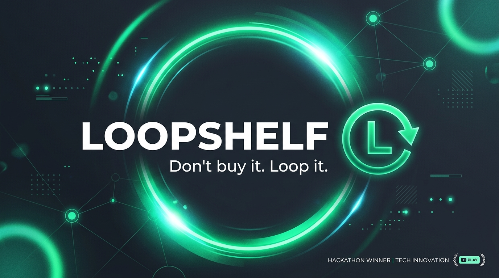

<div align="center">
  
  
  # LOOPSHELF
  **Don't buy it. Loop it.**
  
  *A hyperlocal campus micro-sharing network for short-term access to everyday items.*
</div>

---

## 💡 The Inspiration
Have you ever needed an HDMI cable, a scientific calculator, or an Arduino kit for just a few hours? Most students face a dilemma: buy a new one at full price, or struggle without it. The tragedy is that while you are hitting "Buy Now" on Amazon, the exact item you need is sitting unused in a dorm room 300 meters away.

Campuses don't have a shortage of products; they have a shortage of *access*. We built LoopShelf to fix this.

## 🚀 What it Does
LoopShelf is a hyperlocal peer-to-peer micro-sharing network restricted to verified university students. Instead of an open marketplace designed for selling things permanently (like Facebook Marketplace), LoopShelf is designed around urgent, short-term needs.

Users broadcast a need ("I need a lab coat for 3 hours"). The platform matches them with a verified peer nearby who has it available. They connect, scan a digital QR Borrow Pass to log the transaction, and the borrower returns it when done. LoopShelf tracks "Borrowability"—showing exactly how much money was saved and how much waste was avoided by keeping items in circulation (aligning with UN SDG 12).

## 💻 Tech Stack
* **Frontend:** React, Vite, Tailwind CSS v4
* **Design:** Figma
* **Concepts:** Artificial Intelligence (Demand Forecasting), PostgreSQL, PostGIS

## 🛠️ How to run the prototype locally

1. Clone the repository:
   ```bash
   git clone https://github.com/Brijuval/loopshelf-hackathon.git
   ```
2. Navigate to the prototype directory:
   ```bash
   cd loopshelf-hackathon/prototype
   ```
3. Install dependencies:
   ```bash
   npm install
   ```
4. Start the development server:
   ```bash
   npm run dev
   ```
5. Open your browser and go to `http://localhost:5173`

## 📁 Repository Structure
* `/prototype` - The interactive React/Vite/Tailwind source code.
* `/docs` - Contains our complete Hackathon submission package (Competitor Validation, Tech Architecture, Pitch Script, Figma Specs, and Pitch Deck).
* `/assets` - Media and images used in the project.
