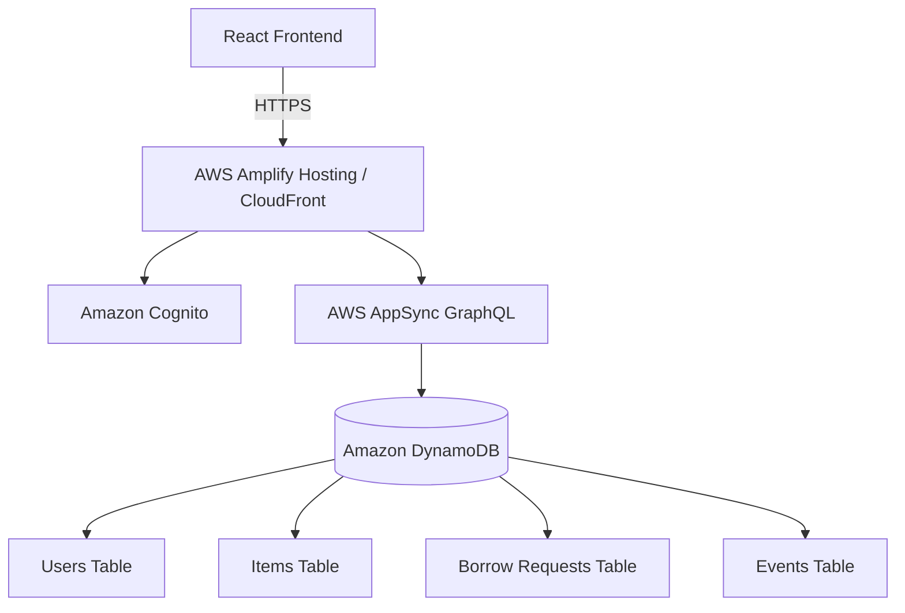

# AWS Architecture

## Overview
LoopShelf is deployed using **AWS Amplify Gen 2 (Fullstack TypeScript)**. This architecture was chosen because it allows for rapid, serverless deployment of a React frontend alongside a managed GraphQL backend, aligning perfectly with the "Zero to Shipped" hackathon ethos.

## Services Used

### 1. AWS Amplify Hosting
* **Role:** Hosts the React (Vite) frontend application.
* **Why:** Provides continuous deployment from GitHub and automatically provisions a public HTTPS URL (the "Ship Gate" requirement) with edge delivery via Amazon CloudFront.

### 2. Amazon Cognito (Amplify Auth)
* **Role:** Manages user authentication and identity.
* **Why:** Allows secure sign-in for users. For our MVP demo, we utilize a simplified "Demo Mode" authentication mechanism, but Cognito handles the backend user pool and role-based access control.

### 3. Amazon DynamoDB (Amplify Data)
* **Role:** The primary NoSQL database.
* **Why:** Serverless, highly scalable, and perfectly integrated with AppSync. We use it to store our core collections: `User`, `Item`, `BorrowRequest`, and `Event`.

### 4. AWS AppSync
* **Role:** Provides the GraphQL API.
* **Why:** Acts as the secure data layer between our React frontend and DynamoDB, allowing real-time subscriptions and efficient data fetching.

## Architecture Diagram (Logical)

## Security & Scalability
* **Environment Variables:** All secrets are managed securely within AWS Amplify environment variables.
* **Scalability:** By relying entirely on serverless managed services (Cognito, AppSync, DynamoDB), the application scales down to zero when unused (perfect for an MVP) and can handle significant traffic spikes during campus events without infrastructure management.
